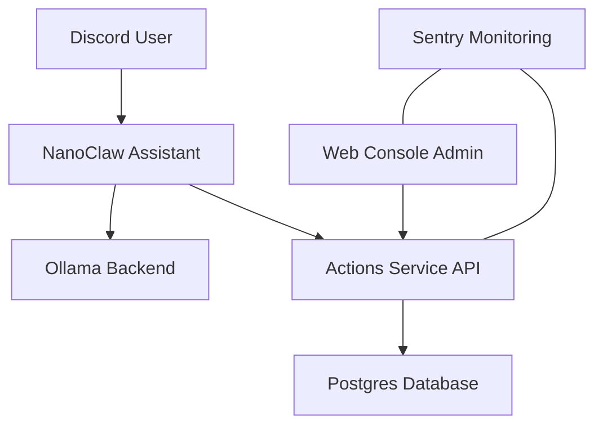

# Paul Architecture

Ce document décrit l'architecture technique du système Paul.

## Vue d'ensemble

Paul est un assistant IA mono-repo structuré en plusieurs services interconnectés via Docker.

## Composants Clés

### 1. NanoClaw (Orchestrateur)
- **Rôle** : Reçoit les messages Discord, gère la mémoire courte et longue (Postgres/Fichiers), et appelle les actions.
- **Backend LLM** : Ollama (Kimi/GLM-5).
- **Intégrations** : Discord.

### 2. Actions Service (Backend)
- **Techno** : Node.js (TypeScript) + Express.
- **ORM** : Prisma.
- **Fonction** : Point d'entrée pour la base de données, gestion du pipeline client et envoi d'emails.

### 3. Web Console (Admin Interface)
- **Techno** : Next.js + Shadcn UI.
- **Fonction** : Visualisation du dashboard, gestion des clients et suivi des activités.

### 4. Infrastructure
- **Déploiement** : Docker Compose sur VPS Ubuntu.
- **Réseau** : Cloudflare (DNS + Proxy).
- **Monitoring** : Sentry.
